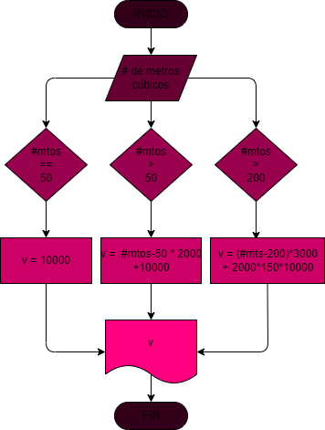

# Calcular el gasto de agua de una viviendo dado el # de metros cúbicos gastados, siendo el sistema de cobro el siguiente: 

## 1. Cota fija mensual: 10.000 pesos
## 2. Los primeros 50 mts cúbicos son gratis
## 3. Entre 50 y 200 mts cúbicos se cobra el mt cúbico a 2000 pesos
## 4. A partir de 200 mts cúbicos se cobra el mt a 3000 pesos

### Diagrama de Flujo
